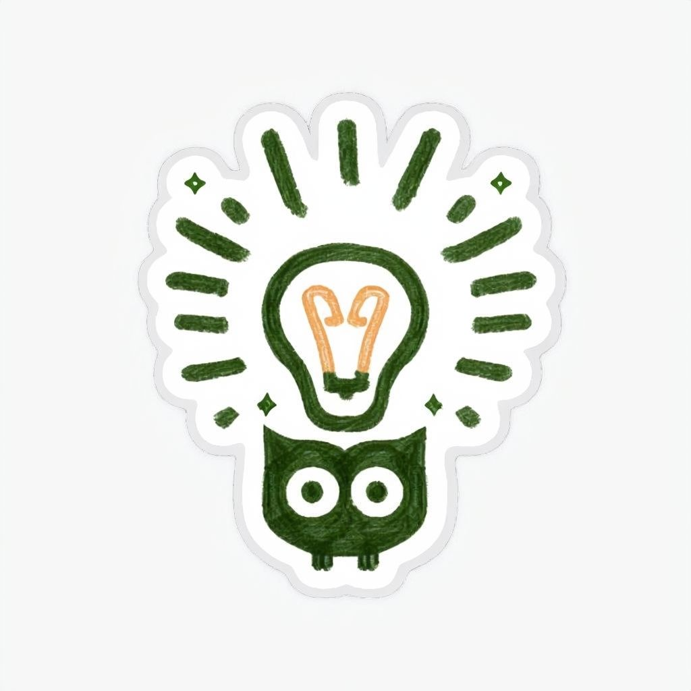

  

<h1 align="center">the-notes</h1>

  <em>Collection of notes learning Computer Science.</em>

This repository serves as a personal collection of notes, insights, and summaries gathered during the journey of learning Artificial Intelligence (AI). It includes concepts, tutorials, code snippets, and references to useful resources.

# Topics

## Algorithms

- [ ] [Kalman Filter](./algo/kalman-filter.ipynb)
- [ ] [Linear Assignment]()

## Computer Vision

- [ ] Single Object Tracking. 
- [ ] Multiple Object Tracking. 

## Natural Language Processing. 

- Sentiment Analysis. 

# Maintainer 

- [Le Duc Minh](https://github.com/MinLee0210)